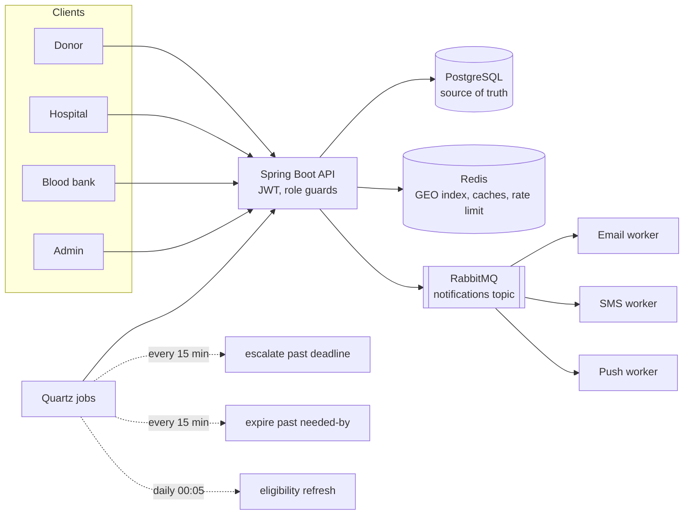

# LifeLink

A blood donor–hospital matching platform. Hospitals raise requests for blood, the
system finds nearby compatible donors and notifies them, and requests that nobody
confirms in time escalate to blood banks.

Built to [docs/PROJECT_SPEC.md](docs/PROJECT_SPEC.md): Spring Boot 3 · PostgreSQL ·
Redis · RabbitMQ · Quartz · JWT.

📖 **[Documentation site](https://suchetan1265.github.io/lifelink/)** — the user guide and
the technical design document, published from `docs/`.

**Using the app?** See the [user guide](docs/USER_GUIDE.md) — what each role can do,
the request lifecycle, and why a screen might be empty. This README is the technical
side: architecture, setup and tests.

---

## How it fits together



**Postgres is the source of truth.** Redis is a derived index and cache, and every
path that touches it falls back to SQL rather than failing: matching drops to a
Haversine query, the dashboard drops to an uncached aggregate, and the rate limiter
fails open so a hospital with an emergency is never locked out. The GEO sets are
rebuilt from Postgres on startup so a cold or flushed Redis cannot silently shrink
the pool of donors matching can reach.

**Donors are reached two ways.** The matching engine pushes a request at the
nearest compatible donors when it is raised, and donors can also browse every
open request their blood group can serve within their travel radius and
volunteer for one. Either way a donor holds only one live commitment at a time —
you can give blood once per visit, and two hospitals must never both be counting
on the same person.

**Notifications are written synchronously and delivered asynchronously.** The row
the notification bell reads is committed with the work that caused it; email, SMS
and push are published to RabbitMQ *after* that transaction commits, so an operation
that rolls back cannot send mail about something that never happened.

### Request lifecycle

```
RAISED ──DONOR_ACCEPTED──> MATCHED ──HOSPITAL_CONFIRMED──> CONFIRMED ──DONATION_RECORDED──> FULFILLED
  │           │                                                ▲
  └───────────┴──ESCALATE_TIMEOUT──> ESCALATED ──BANK_ACCEPTED──┘
  │           │                          │
  └───────────┴──NEEDED_BY_PASSED────────┴──> EXPIRED

any non-terminal state ──CANCEL──> CANCELLED
```

Every transition goes through `RequestLifecycleService`, which rejects illegal
events, stamps timestamps and writes a `request_status_history` row. Guards enforce
that a hospital cannot confirm a donor who never accepted, and that a bank cannot
fulfill without stock.

Escalation deadlines come from the urgency: `CRITICAL` 2h, `HIGH` 6h, `NORMAL` 24h.

---

## Running it locally

### Prerequisites

| Tool | Notes |
|---|---|
| Java 17+ | Eclipse Temurin |
| PostgreSQL 16 | Or use the bundled `docker-compose.yml` |
| Docker | Optional, for Redis and RabbitMQ |
| Node.js LTS | For the frontend |

The app starts and works without Redis or RabbitMQ — you lose the GEO index,
caching, the rate limit and email delivery, and everything else degrades to SQL.

### Database

```sql
CREATE DATABASE lifelink;
CREATE USER lifelink_app WITH PASSWORD 'changeme';
GRANT ALL PRIVILEGES ON DATABASE lifelink TO lifelink_app;
```

Flyway owns the schema and applies migrations on boot; Hibernate only validates
that the entities match.

### Redis and RabbitMQ

```bash
docker compose up -d
```

**Without Docker (Windows).** Redis has no official Windows build, and the
`Redis.Redis` winget package is version 3.0, which predates the `GEO*` commands
this project's matching depends on — it will not work. Two options that do:

- **Memurai Developer** (`winget install Memurai.MemuraiDeveloper`) — a maintained
  Redis-compatible server that installs as a Windows service.
- **The test binary.** `embedded-redis` ships a real `redis-server` 5.0.14 for
  Windows, which is what the test suite runs against. Extract and run it:

  ```bash
  cd ~/lifelink-redis
  unzip -j ~/.m2/repository/com/github/codemonstur/embedded-redis/1.4.3/embedded-redis-1.4.3.jar \n    redis-server-5.0.14.1-windows-amd64.exe
  ./redis-server-5.0.14.1-windows-amd64.exe --port 6379
  ```

Redis 3.2 or newer is required either way, for `GEOADD` and `GEORADIUS`.

### Start the API

```bash
cd backend
./mvnw spring-boot:run -Dspring-boot.run.profiles=dev
```

It listens on **8080**, or whatever `SERVER_PORT` is set to — Oracle XE and Apache
claim 8080 and 8081 on some machines, so set `SERVER_PORT=8082` and start the
frontend with a matching `VITE_API_TARGET`. The `dev` profile supplies throwaway local values for the
JWT signing key, database password and admin password. Those are **not** defaults
in `application.yml` on purpose: a signing key published in this repository would
let anyone mint tokens for a deployment that forgot to override it, so the app
refuses to start unless `JWT_SECRET` is set some other way.

On first start `AdminBootstrap` creates the admin account from `app.admin.*`,
because without an admin nobody can verify a hospital and no request could ever be
raised. A blank admin password skips that, with a warning.

To also load demo data (one hospital, one blood bank, twelve donors around Bengaluru):

```bash
./mvnw spring-boot:run -Dspring-boot.run.profiles=dev,seed
```

Seeded accounts are `hospital@lifelink.local`, `bloodbank@lifelink.local` and
`donor1..12@lifelink.local`, all with password `password123`.

### Configuration

Secrets are read from the environment; the defaults in `application.yml` are
development-only.

| Variable | Purpose |
|---|---|
| `JWT_SECRET` | **Required.** HS256 signing key, 32+ bytes. No default — startup fails without it |
| `DB_PASSWORD` | Postgres app-user password |
| `ADMIN_EMAIL` / `ADMIN_PASSWORD` | Bootstrapped admin account; blank password skips the bootstrap |
| `MAIL_USER` / `MAIL_PASSWORD` | Mailtrap credentials; blank keeps email in log-only mode |
| `GOOGLE_CLIENT_ID` | Enables Sign in with Google; blank hides the button. Public value, not a secret |
| `WEB_BASE_URL` | Origin password-reset links point at; defaults to the Vite dev server |
| `REDIS_HOST`, `RABBITMQ_HOST` | Default to localhost |

### Start the frontend

```bash
cd frontend
npm install
npm run dev
```

It serves on **5173** and proxies `/api` to the backend, so the browser stays
same-origin and there is no CORS preflight in development. If the backend is not
on 8080, point the proxy at it:

```bash
VITE_API_TARGET=http://localhost:8082 npm run dev
```

Sign in as any seeded account to land on that role's dashboard. Routes are guarded
by role on the client and enforced again on the server.

---

## Tests

```bash
cd backend
./mvnw test
```

Tests boot the real application against an **embedded PostgreSQL** — a real server,
not H2, so Flyway migrations and native SQL run exactly as in production, and no
Docker is required.

Most tests run with Redis and RabbitMQ *absent*, which is deliberate: it keeps the
degradation paths covered. `RedisIntegrationTest` starts a real embedded Redis for
the cases that must prove the Redis path itself works.

---

## API

Base path `/api`. All endpoints except registration, login, refresh and
`/meta/**` require `Authorization: Bearer <accessToken>`.

Access tokens last 15 minutes. Refresh tokens last 7 days, are stored hashed, and
rotate on every use — presenting one revokes it and issues a new pair.

| Area | Endpoints |
|---|---|
| Auth | `POST /auth/register/{donor,hospital,bloodbank}`, `POST /auth/{login,refresh,logout}`, `GET /auth/me` |
| Donor | `GET/PUT /donors/me`, `PATCH /donors/me/availability`, `GET /donors/me/{matches,donations,eligibility,opportunities}`, `POST /donors/me/opportunities/{requestId}/accept`, `POST /matches/{id}/{accept,decline}` |
| Hospital | `POST/GET /requests`, `GET /requests/{id}`, `GET /requests/{id}/{matches,history}`, `POST /requests/{id}/matches/{matchId}/confirm`, `POST /requests/{id}/{fulfill,cancel}` |
| Blood bank | `GET/PUT /bloodbanks/me/inventory`, `GET /bloodbanks/me/escalations`, `POST /escalations/{id}/{accept,fulfill}` |
| Admin | `GET /admin/verifications?type=hospital\|bloodbank`, `POST /admin/verifications/{userId}/{approve,reject}`, `GET /admin/stats`, `PATCH /admin/users/{id}/status` |
| Shared | `GET /notifications`, `PATCH /notifications/{id}/read`, `GET /meta/blood-groups` |

Errors are RFC 7807 `ProblemDetail` documents. Hospitals are capped at **10 requests
per hour**, which returns `429`.

Verification paths take the account's **user id**, which is what the queue returns
as `userId` — it identifies a hospital or a blood bank uniformly.

---

## Layout

```
frontend/src/
  api/          axios instance, refresh-on-401 interceptor, endpoint calls
  auth/         session context and the role route guard
  components/   layout, notification bell, status chips, donor map
  pages/        one folder per role, plus the public landing and auth screens

backend/src/main/java/com/lifelink/
  admin/        verification queue, platform stats, account status
  auth/         registration, login, refresh-token rotation
  bloodbank/    inventory, escalation queue, accept/fulfill
  common/       blood groups and compatibility, errors, geo distance
  dev/          seed profile
  donor/        profile, availability, eligibility, history
  hospital/     hospital entity and lookup
  job/          Quartz jobs and their schedule
  messaging/    RabbitMQ exchange, publisher, channel workers
  notification/ in-app notification rows
  redis/        GEO index, caches, rate limiter
  request/      request lifecycle, matching engine, donor responses
  security/     JWT issuing and the auth filter
  user/         accounts and roles
```

---

## Known gaps

- **No frontend tests.** The build, the dev server and the API path through the Vite
  proxy are all verified, and the full request lifecycle has been exercised against
  a real database, but no screen has been driven through a browser.
- **Spring State Machine** is a dependency but unused; `RequestLifecycleService`
  hand-rolls the transition table in `RequestEvent`, which satisfies §3 (validated
  transitions plus an audit row) with far less machinery. Either wire it up or drop
  the dependency.
- **`donor:{id}:profile` caches the donor's own dashboard read**, not the match
  ranking as §7 describes. Ranking still has to reach Postgres to exclude donors
  already tied to an active request, so a profile cache would not save the query.
- **Blood banks have no per-bank radius**, so escalation uses a fixed 50 km reach.
